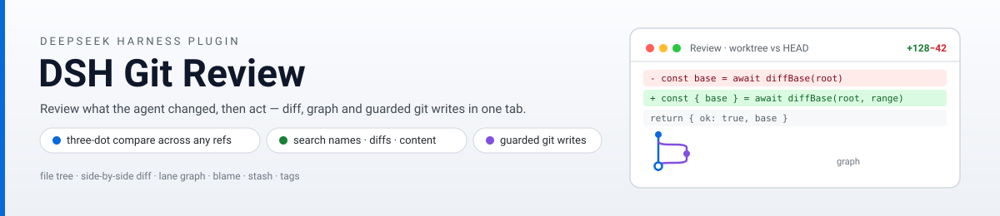

<p align="center">
  <picture>
    <source media="(prefers-color-scheme: dark)" srcset="docs/banner-dark.svg">
    
  </picture>
</p>

# DSH Git Review

<p align="center">English | <a href="README.zh.md">中文文档</a></p>

<p align="center">
  <a href="https://www.npmjs.com/package/dsh-git-review"></a>
  <a href="https://www.npmjs.com/package/dsh-git-review"></a>
  
  =0.1.2-rc.1">
  
  <a href="LICENSE"></a>
  
</p>

A **Review tab plus fenced git workbench** for DeepSeek Harness: everything an agent changed, laid out for a decision — file tree, diffs, commit graph — with guarded git operations in the same place.

<p align="center">
  
</p>

## What it does

DSH Git Review registers a **Review** tab next to Chat and Trajectory in the session view. It shows the workspace repository against HEAD — or any two refs — and lets you act on what you see without leaving the tab:

- **Review first**: filterable file tree with status badges, side-by-side / unified / full-file diffs, hunk folding, word-level change highlights, syntax coloring, and diff search across file names, diff text, and file content. Keyboard-first: `j`/`k` move between files, `/` focuses search.
- **Decide with history**: a lane commit graph with per-commit files and diffs, blame gutters, per-file history, and reading any file version from history.
- **Act under guard**: stage / unstage / discard per file or per hunk, commit (plus amend, Ctrl+Enter), commit-and-push, and push; branches (create / switch / rename / delete / merge / track remotes) with fetch and pull; history operations (reset / revert / cherry-pick, per-commit actions from the graph); lightweight tags (create / delete / push); stash; and merge-conflict resolution (ours / theirs, continue / abort). Every write needs explicit confirmation, destructive ones ask twice, and everything locks while the agent is running.
- **Close the loop**: comment on any diff line and drop it into the composer draft, mark files reviewed (auto-cleared when the file changes again), and keep comment drafts per workspace.
- **Preview files**: markdown renders with the shell's own Markdown engine, HTML / images / SVG show inline, PDFs open sandboxed — every preview has a source view toggle, and office documents open in your external apps from the tree's right-click menu.

Preferences (diff layout, default search scope, graph shape, matching, whitespace, syntax) live in the harness settings Plugins tab and sync instantly with the Review tab.

## Install

From npm:

```bash
dsh plugin --profile web add dsh-git-review
dsh web
```

Or from a local tarball:

```bash
pnpm install
pnpm build
pnpm pack
dsh plugin --profile web add ./dsh-git-review-0.1.0.tgz
dsh web
```

Requires DeepSeek Harness `>=0.1.2-rc.1`, the harness workspace to sit inside a git repository, and git on the host PATH. Anywhere else, the tab degrades to explicit guidance copy — never a blank screen.

## Checks

```bash
pnpm typecheck      # strict, noEmit
pnpm check:parse    # pure-function regression (Node >= 23.6 native TS stripping)
pnpm check:git      # real-git fixture integration (repositories under .tmp-check-git/)
pnpm build          # lib/index.js (node) + lib/client.js (browser factory bundle)
```

## How it works

- **Host half**: an in-process cordis plugin serving a fenced prefix route for versioned API actions over JSON (non-JSON bodies get 415, which also closes the classic no-cors write vectors). Every path is fenced inside the session workspace repository, every ref is re-resolved server-side, commit ids only travel as 40-hex, and GIT_DIR-style environment hijacks are scrubbed.
- **Client half**: a conversation-view slot component; the host route is optional — without it the tab says so instead of erroring.
- **Scale guards**: 20k-row render cap, 2 MiB per-file diff cap, 500-commit graph pages with load-more, and an 8 MiB streaming byte cap (the child is killed past it) on the largest git answers.
- Interface languages: Simplified Chinese and English, following the harness locale; dark and light themes via semantic tokens.

MIT © HaoyueQin
