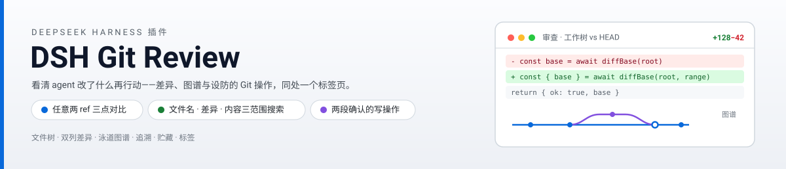

<p align="center">
  <picture>
    <source media="(prefers-color-scheme: dark)" srcset="docs/banner-zh-dark.svg">
    
  </picture>
</p>

# DSH Git Review

DeepSeek Harness 的**审查标签页 + 围栏 Git 工作台**：把 agent 改了什么摆在一页里做决定——文件树、差异、提交图谱，设防的 Git 操作同处一页。



[English](README.md)

## 它能做什么

DSH Git Review 在会话视图里对话与轨迹旁边注册一个**审查**标签页。展示工作区仓库相对 HEAD（或任意两 ref）的状态，看完直接动手，不用切走：

- **先审后动**：可过滤的文件树（状态徽标）、双列 / 单列 / 全文三档差异、hunk 折叠、词级改动高亮、语法着色，以及文件名 / 差异内容 / 文件内容三范围搜索。
- **用历史做判断**：泳道提交图谱（每提交的文件与差异）、blame 边栏、单文件历史，可读历史中任意版本的文件全文。
- **设防的操作**：按文件或按 hunk 暂存 / 取消暂存 / 放弃，提交（含 amend、Ctrl+Enter）与推送，分支（创建 / 切换 / 重命名 / 删除 / 合并 / 跟踪远端），轻量标签（创建 / 删除 / 推送），贮藏，以及合并冲突解决（ours / theirs，继续 / 中止）。每次写操作都要明确确认，破坏性操作确认两遍，agent 运行中全部上锁。
- **审查闭环**：在任意差异行写评论并送入对话输入框，把文件标为已审（文件再改自动取消），评论草稿按工作区分存。
- **文件预览**：markdown 用宿主自带的 Markdown 引擎渲染，HTML / 图片 / SVG 内联展示，PDF 沙箱打开——每种预览都有源码切换，办公文档请在文件树右键用外部应用打开。

偏好（差异布局、默认搜索范围、图谱形态、匹配方式、空白、语法高亮）放在 harness 设置的插件标签页，与审查标签页即时互相同步。

## 安装

```bash
pnpm install
pnpm build
pnpm pack
dsh plugin --profile web add ./dsh-git-review-0.1.0.tgz
dsh web
```

要求 harness 工作区位于 git 仓库内，且宿主 PATH 里有 git。其他情况下标签页内给出明确指引，绝不白屏。

## 检查

```bash
pnpm typecheck      # 严格类型检查
pnpm check:parse    # 纯函数回归（Node >= 23.6 原生 TS 剥离）
pnpm check:git      # 真实 git 夹具集成测试（仓库建在 .tmp-check-git/ 下）
pnpm build          # lib/index.js（node 端）+ lib/client.js（浏览器端 bundle）
```

## 工作原理

- **Host 半**：宿主进程内的 cordis 插件，经围栏前缀路由提供 JSON 动作接口（非 JSON 请求体直接 415，顺带关掉经典 no-cors 写向量）。所有路径围栏在会话工作区的仓库内，所有 ref 服务端复核，commit id 只收 40-hex，并清洗 GIT_DIR 一类环境劫持。
- **浏览器半**：会话视图插槽组件；host 路由可选——缺席时标签页明示而不报错。
- **规模护栏**：2 万行渲染帽、单文件 2 MiB 差异帽、图谱 500 提交分页加载、最大 git 输出 8 MiB 流式字节帽（超限杀进程）。
- 界面语言：简体中文与英文，随 harness 语言切换；深浅主题走语义 token。

## 范围说明

- **为什么不用 Remote API**：新客户端命名空间要 harness 构建的生成编解码器加显式的 api-remotes 组装选择，第三方插件改走插件自营路由（与围栏文件 API 同一信任模型）。
- 仓库级而非工作区子目录级：审查展示的是包含会话工作区的那个仓库（status/diff 本来就是仓库级语义）。
- 明确不做：rebase 流程、三栏手动解冲突编辑、多仓库切换、worktree 管理、可编辑差异。

MIT © HaoyueQin
